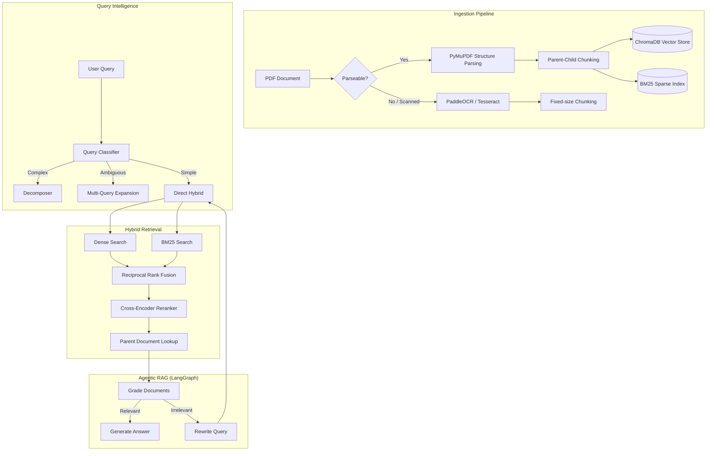

# Enterprise Document Intelligence & Agentic RAG Platform

A production-grade, highly advanced Agentic Retrieval-Augmented Generation (RAG) platform. This project goes far beyond a basic LangChain tutorial, implementing state-of-the-art techniques for document ingestion, retrieval, and QA.

## 🌟 Key Features

1. **Agentic RAG (LangGraph)**
   - Self-correcting retrieval loop.
   - LLM grades retrieved documents for relevance.
   - Automatically rewrites queries and retries if initial retrieval fails.

2. **Advanced Document Ingestion**
   - **Structure-Aware Parsing:** Uses `PyMuPDF` to detect headings, sections, and paragraphs instead of blindly chunking by character count.
   - **Parent-Child Chunking:** Small child chunks (e.g. 1000 chars) are embedded for high-precision vector search, while the LLM receives the full parent section (e.g. 3000 chars) for maximum context.
   - **Fallback OCR:** Automatically routes scanned/image-heavy PDFs to `PaddleOCR` and `Tesseract`.

3. **Hybrid Search Pipeline**
   - **Dense Search:** Semantic vector search using BAAI/bge-small-en-v1.5.
   - **Sparse Search:** Keyword-based BM25 retrieval for exact matches (e.g. specific metrics, acronyms, model names).
   - **Reciprocal Rank Fusion (RRF):** Mathematically merges Dense and BM25 rankings without needing score normalization.
   - **Cross-Encoder Reranking:** Re-scores the top 30-40 candidates jointly using `ms-marco-MiniLM-L-6-v2` for maximum precision.

4. **Query Intelligence**
   - **Query Decomposition:** Breaks complex multi-part questions (e.g. "What is X and how does it compare to Y?") into parallel sub-queries.
   - **Multi-Query Expansion:** Paraphrases ambiguous queries into N variants to maximize semantic recall.
   - **HyDE (Hypothetical Document Embedding):** Opt-in ability to generate a hypothetical answer and embed that instead of the raw query.

5. **Production Readiness**
   - **React + Vite Frontend:** A beautiful, responsive, glassmorphic UI built with Tailwind CSS, Framer Motion, and Markdown streaming.
   - **FastAPI Backend:** A fully functioning REST API wrapper around the Agentic RAG core handling SSE streaming.
   - **CI/CD Pipeline:** Integrated GitHub Actions for automated linting, checking, and building on every push.
   - **Dockerized:** Fully containerized with `docker-compose` for instant deployment.
   - **Langfuse Observability:** Deep tracing of all LLM calls, token usage, and retrieval logic.

---

## 🏗️ System Architecture



---

## 🚀 Quickstart (Docker)

The absolute easiest way to run the platform is via Docker. This skips all Python environment, Node.js, and OCR dependency setups.

1. Clone the repository and navigate to the directory.
2. Create a `.env` file (see `.env.example`). At minimum, you need a Groq API key:
   ```env
   GROQ_API_KEY=gsk_your_api_key_here
   ```
3. Run `docker-compose`:
   ```bash
   docker-compose up --build
   ```
4. Access the platforms:
   - **React UI:** [http://localhost:5173](http://localhost:5173) (or port mapped in docker)
   - **FastAPI Swagger UI:** [http://localhost:8000/docs](http://localhost:8000/docs)

---

## 🛠️ Local Development Setup

If you want to run the platform locally on Windows/Mac/Linux without Docker:

### 1. Prerequisites
- **Python 3.10 - 3.13**
- **Node.js 18+**
- **Tesseract OCR:** 
  - Windows: Install from [UB-Mannheim](https://github.com/UB-Mannheim/tesseract/wiki) and ensure the path in `app/core/config.py` matches your installation (default: `C:\Program Files\Tesseract-OCR\tesseract.exe`).
  - Linux/Mac: `sudo apt install tesseract-ocr` / `brew install tesseract`

### 2. Backend Setup
```bash
python -m venv venv
# Windows
.\venv\Scripts\activate
# Linux/Mac
source venv/bin/activate

pip install -r requirements.txt
```

Create a `.env` file in the root directory:
```env
GROQ_API_KEY=gsk_your_api_key_here

# Optional: Langfuse Tracing
LANGFUSE_PUBLIC_KEY=pk-lf-...
LANGFUSE_SECRET_KEY=sk-lf-...
LANGFUSE_HOST=https://cloud.langfuse.com
```

Run the FastAPI Backend:
```bash
python -m uvicorn app.api.main:app --reload --port 8000
```

### 3. Frontend Setup
Open a new terminal and navigate to the `frontend` folder:
```bash
cd frontend
npm install
npm run dev
```

---

## 🔬 Observability (Langfuse)

This project integrates heavily with **Langfuse** for observability. By providing your Langfuse API keys in the `.env` file, the platform will automatically trace:
- The execution flow of the LangGraph agent.
- Every individual LLM prompt and response.
- Token counts and latency for generation, query rewriting, and document grading.
- The exact documents retrieved during the RAG process.

---

## 📝 Future Roadmap

- **Persistent Qdrant Vector Store:** Transitioning from ephemeral ChromaDB to a persistent Qdrant instance.
- **GraphRAG Integration:** Building a Neo4j knowledge graph from document entities.
- **RAGAS Evaluation:** Automated golden dataset generation and pipeline evaluation.